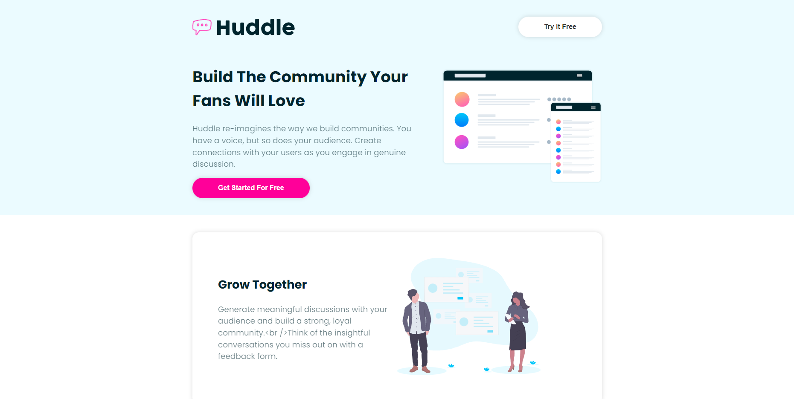
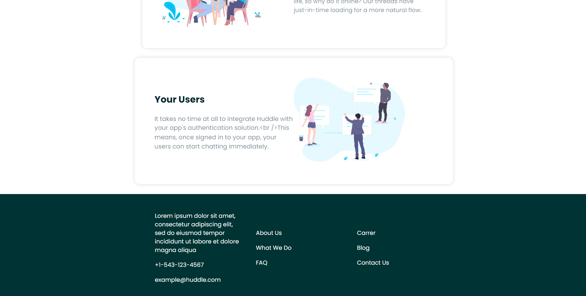

# Frontend Mentor - Huddle landing page with alternating feature blocks solution

 

This is a solution to the [Huddle landing page with alternating feature blocks challenge on Frontend Mentor](https://www.frontendmentor.io/challenges/huddle-landing-page-with-alternating-feature-blocks-5ca5f5981e82137ec91a5100). Frontend Mentor challenges help you improve your coding skills by building realistic projects. 

 

## Table of contents

- [Overview](#overview)
  - [The challenge](#the-challenge)
  - [Screenshot](#screenshot)
  - [Links](#links)
- [My process](#my-process)
  - [Built with](#built-with)
- [Author](#author)

 

## Overview

### The challenge

Users should be able to:

- View the optimal layout for the site depending on their device's screen size
- See hover states for all interactive elements on the page

 

### Screenshot

 

### Links

- Live Site URL: [https://adrielgamorim.github.io/huddle-landing-page/](https://adrielgamorim.github.io/huddle-landing-page/)

 

## My process

### Built with

- [React](https://reactjs.org/) - JS library
- [Next.js](https://nextjs.org/) - React framework
- [Styled Components](https://styled-components.com/) - For styles
- [React Icons](https://react-icons.github.io/react-icons/) - For social icons

 

## Author

- Frontend Mentor - [@AdrielGAmorim](https://www.frontendmentor.io/profile/AdrielGAmorim)
